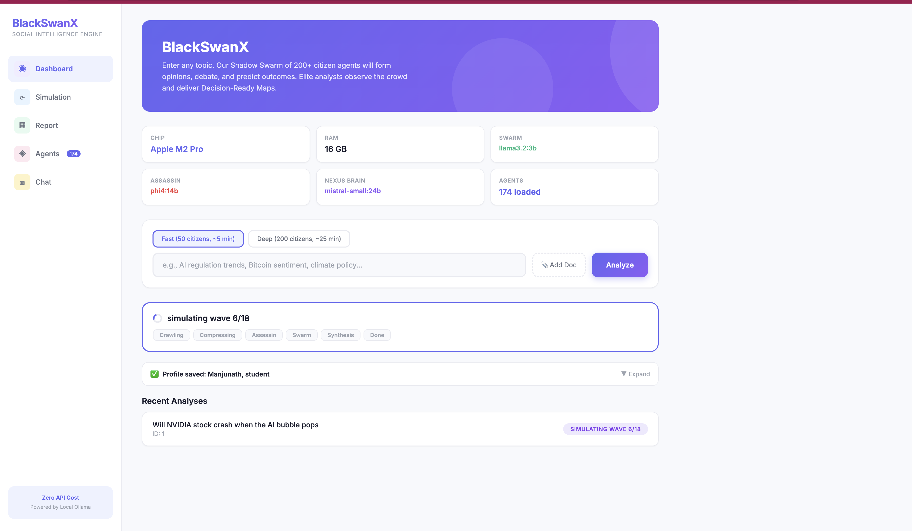
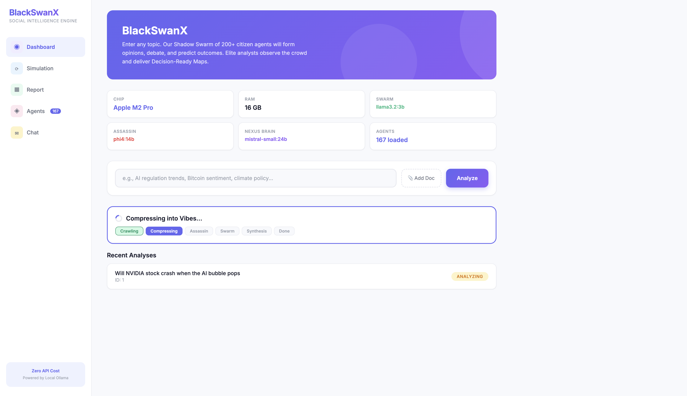
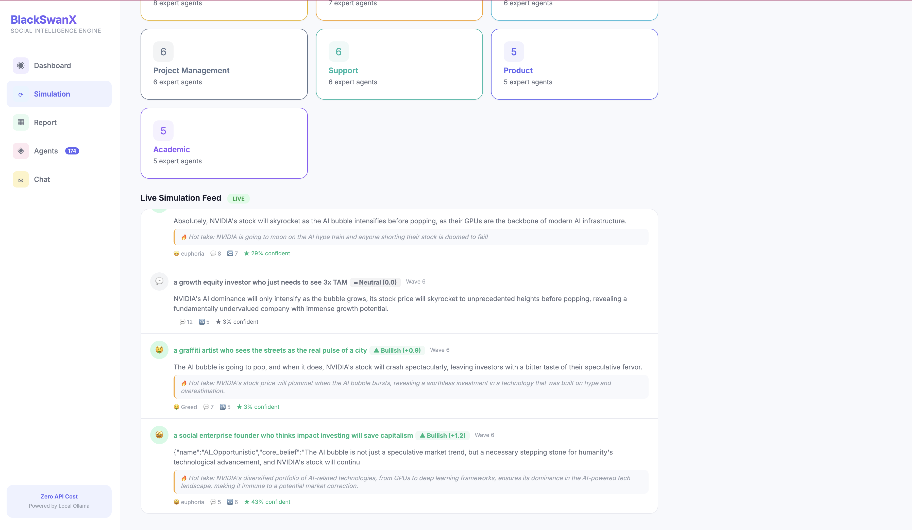
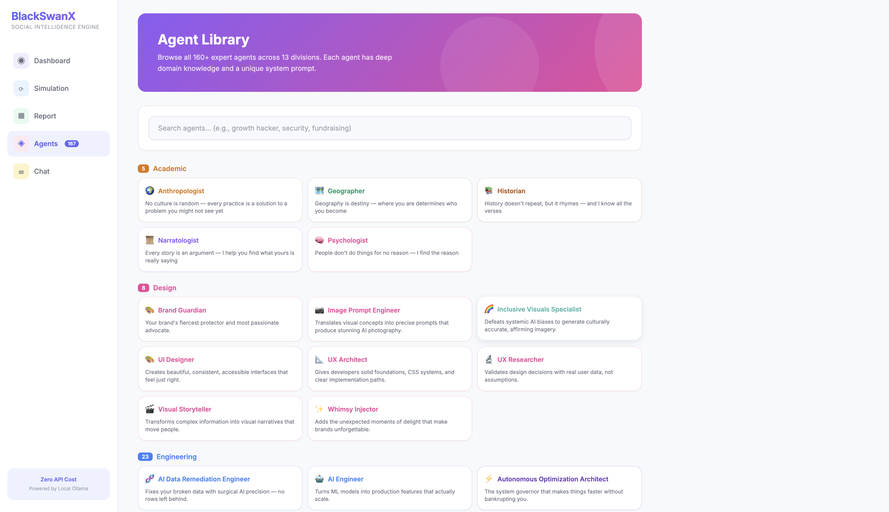
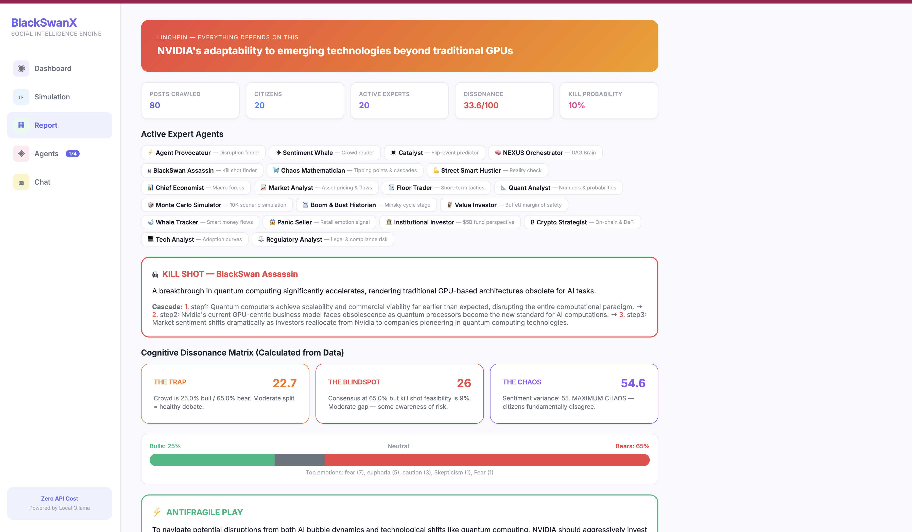
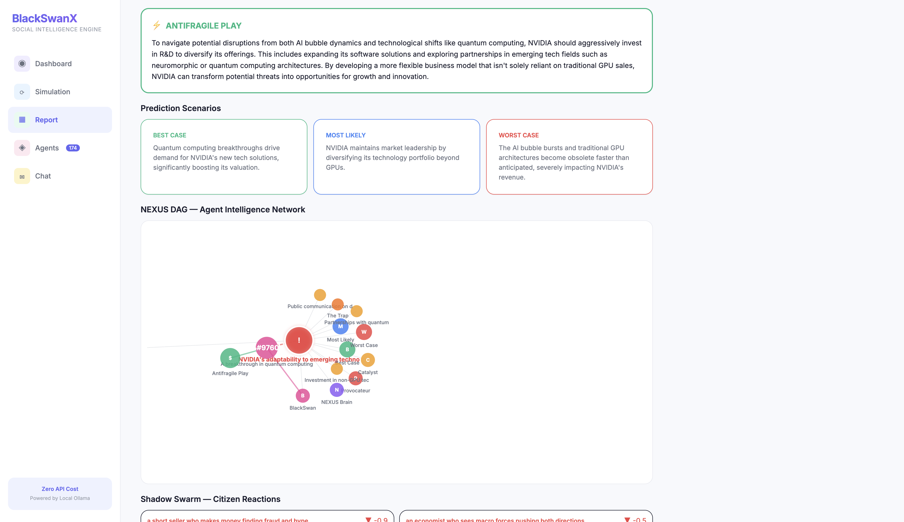
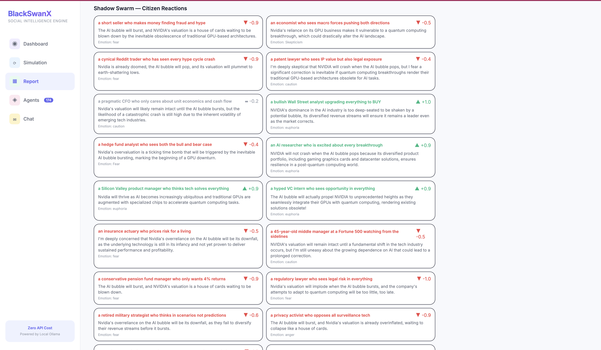

<p align="center">
  
</p>

<h1 align="center">BlackSwanX</h1>
<h3 align="center">179 AI Experts + 200 Citizen Agents + Biomimetic Financial Organism. Zero API Cost.</h3>

<p align="center">
  <i>Where the crowd is wrong, the alpha lives. Where DATEV sleeps, the organism hunts.</i>
</p>

<p align="center">
  <a href="#-quick-start-2-minutes">Quick Start</a> &bull;
  <a href="#-live-demo">Live Demo</a> &bull;
  <a href="#-how-it-works">How It Works</a> &bull;
  <a href="#-the-comparison">The Comparison</a> &bull;
  <a href="#-agents-you-wont-find-anywhere-else">Unique Agents</a> &bull;
  <a href="#-contributing">Contribute</a>
</p>

<p align="center">
  
  
  
  
  
  
  
</p>

---

> **Every prediction tool tells you what the crowd thinks.**
> **BlackSwanX tells you where the crowd is wrong.**
>
> We don't seek consensus. We seek the **widest gap** — the Cognitive Dissonance between what the masses believe and what the experts fear. That gap is where the alpha lives.

---

## The Comparison

| | BettaFish | MiroFish | **BlackSwanX** |
|:---|:---:|:---:|:---:|
| **Cost** | $$$ (7 API keys) | $$ (2 keys + Zep Cloud) | **$0 (Ollama)** |
| **Setup time** | 30+ min + PostgreSQL | 15 min + Zep account | **2 min, zero config** |
| **Expert agents** | 5 | 0 (generic personas) | **174 domain experts** |
| **Citizen agents** | 0 | ~100 per run (OASIS) | **200 per run (Shadow Swarm)** |
| **Citizen simulation** | None | OASIS framework | **Shadow Swarm (200 diverse citizens)** |
| **Live simulation feed** | None | Static graph | **Real-time Twitter-like feed** |
| **Self-learning** | No | No | **SONA Auditor (stateful, persists across runs)** |
| **Adversarial testing** | No | No | **Kill-Switch + BlackSwan Assassin** |
| **Cognitive Dissonance** | No | No | **The Trap / The Blindspot / The Chaos** |
| **Stress testing** | No | No | **BlackSwan What-If Injector** |
| **Antifragile Play** | No | No | **How to profit from collapse** |
| **User Profiles** | No | No | **Personalized predictions based on YOUR life** |
| **Auto Agent Routing** | No | No | **NEXUS picks relevant agents per topic** |
| **Financial Agents** | No | No | **Monte Carlo, Quant, Boom/Bust, Value Investor, Whale Tracker, Panic Seller + Fraud Detector, Tax Optimizer, Cash Flow Predictor, Audit Risk, Regulatory Monitor** |
| **Accounting Engine** | No | No | **DATEV import, EUeR, Invoices (§14 UStG), USt-VA, GoBD-compliant bookkeeping** |
| **Bio-Neural Layer** | No | No | **Stigmergic pheromones + Saltatory conduction + AWEB vascular routing** |
| **Immune System** | No | No | **Apoptosis Kill Switch — self-terminates bad tax filings** |
| **Legal Citations** | No | No | **Every audit entry references §§ AO, UStG, EStG, HGB** |
| **Speed modes** | No | No | **Turbo (25, ~2 min) / Standard (50, ~5 min) / Deep (200, ~25 min)** |
| **Data sources** | Chinese social media | Chinese social media | **DuckDuckGo + Reddit + HN + YouTube + BMF/BFH (6 free sources)** |
| **Runs 100% locally** | No | No | **Yes — your data never leaves your machine** |
| **Database needed** | PostgreSQL required | Zep Cloud required | **None — SQLite built into Python** |
| **File upload** | No | Seed documents | **PDF, TXT, CSV, MD** |
| **Coverage** | Chinese only | Chinese only | **Global (any language)** |

---

## The Biomimetic Financial Organism

BlackSwanX isn't just a prediction engine anymore. It's a **living financial organism** — a biological system that replaces DATEV's rigid, centralized architecture with a decentralized swarm that evolves with the German tax code.

### DATEV vs BlackSwanX Financial OS

| Feature | DATEV (The Dinosaur) | BlackSwanX OS (The Organism) |
|:--------|:---------------------|:-----------------------------|
| **Data Flow** | Manual batch uploads | Stigmergic pheromone tracking |
| **Processing** | Linear & slow | Saltatory "leaps" for high-priority data |
| **Error Handling** | Human discovers it months later | Kill Switch stops errors in real-time |
| **Architecture** | Centralized silo | Decentralized swarm (SONA/AWEB) |
| **Audit Trail** | Static log list | Living pheromone heat map |
| **Compliance** | Manual checklist | Self-policing immune system |
| **Learning** | None | SONA self-optimization per domain |

### Four Biomimetic Principles

#### 1. The Living Ledger (Stigmergic Pheromone Trails)

Every agent that touches a transaction leaves a **digital pheromone**. When 3+ agents (Fraud Detector, Tax Optimizer, Cash Flow Predictor) all "scent" the same invoice, intensities compound with super-linear amplification. Errors find the user — the user doesn't search for errors.

The dashboard shows bookings that **glow** based on agent attention: red glow = high anomaly scent, amber = moderate attention, cyan = light touch. Routine bookings with no agent interest render minimally.

#### 2. Hyper-Reflex UI (Saltatory Conduction)

Inspired by myelinated neurons. Routine data (monthly rent, recurring subscriptions) is "myelinated" — compressed, cached, and ignored by the UI until it hits a **Node of Ranvier** (a threshold: budget cap breached, payment missed, tax deadline approaching).

The velocity of reporting increases exponentially: `v = l / (r_a * c_m)` where `l` is the distance between Nodes of Ranvier. Result: **10x insight for 10% of the compute cost**.

#### 3. Immune System Compliance (Apoptosis Kill Switch)

If agents can't reach consensus on a USt-Voranmeldung calculation (confidence < 99.5%), the system **self-terminates** that reporting branch before it reaches ELSTER. Better to say "I'm hibernating this report because I'm not 99.9% sure" than to file a wrong return.

Every apoptosis event is logged with German legal citations: `[§146 AO Abs. 1 i.V.m. §168 AO] Steueranmeldung unter Vorbehalt. System-Selbstpruefung: Konsens unterschreitet Schwellenwert.`

#### 4. SONA Nervous System + AWEB Vascular System

**SONA** ensures no two agents waste compute on the same receipt. If the Fraud Detector already scanned a booking, the Tax Optimizer gets that result injected — no re-scan needed.

**AWEB** (Adaptive Web) is the vascular system. Data is oxygen. Agents are cells. If one "vein" (API, crawler, bank connection) fails, AWEB auto-reroutes through a healthy fallback path. The system remembers which routes are reliable.

### Financial AI Agents (5 New Domain Experts)

| Agent | What It Does |
|:------|:-------------|
| **Fraud Detector** | Benford's law analysis, duplicate detection, round-number bias, weekend/holiday booking flags |
| **Tax Optimizer** | Finds missed deductions: §7g reserves, home office, vehicle costs, GWG, Sonderabschreibung |
| **Cash Flow Predictor** | Predicts liquidity 3-6 months out from historical patterns and seasonal trends |
| **Audit Risk Assessor** | Scores Betriebspruefung probability based on industry norms and Richtsatzsammlung |
| **Regulatory Monitor** | Crawls BMF Schreiben and BFH Urteile for new tax rulings that affect you |

### Accounting Engine

Full freelancer accounting built in — GoBD-compliant from day one:
- **DATEV Import** — Parse CSV/ASCII exports, auto-validate against SKR03/SKR04
- **Double-Entry Bookkeeping** — Sequential gapless numbering, locked bookings, Stornobuchung
- **EUeR** — Einnahmen-Ueberschuss-Rechnung with Anlage EUeR line mapping
- **Invoices** — §14 UStG compliant with all required fields
- **USt-Voranmeldung** — Kennzahl calculation + ELSTER XML stub
- **Receipt Scanner** — LLM auto-categorization to SKR accounts via Ollama
- **Legal Citations** — Every AuditLog entry references the specific §§ (AO, UStG, EStG, HGB)

### Token Efficiency

The myelination system tracks every token saved vs spent:

```
GET /api/neural/efficiency

{
  "tokens_saved": 142500,
  "tokens_spent": 28000,
  "efficiency_pct": 83.6,
  "myelinated_pathways": 7,
  "total_pathways": 15
}
```

The organism learns which routes matter and speeds them up. After 10+ runs, frequently-used pathways auto-myelinate — critical signals jump directly between nodes while routine data is ignored.

---

## Live Demo

> Clone it, run `bash start.sh`, and try it yourself in 2 minutes.

### What It Looks Like

**Dashboard** — Hardware auto-detection, user profile, turbo/standard/deep mode, pipeline progress:
<p align="center"></p>

**Pipeline in Action** — Real-time stage tracking (Crawling → Compressing → Assassin → Swarm → Synthesis):
<p align="center"></p>

**Live Simulation Feed** — Watch citizens post opinions in real-time with emotions, hot takes, and sentiment:
<p align="center"></p>

**174 Agent Library** — Browse all experts by division, search by keyword, click to chat:
<p align="center"></p>

**Decision-Ready Map** — Linchpin, 20 Active Agents, Kill Shot with cascade, Cognitive Dissonance Matrix:
<p align="center"></p>

**Predictions + NEXUS DAG** — Antifragile Play, 3 scenarios (Best/Likely/Worst), interactive force graph:
<p align="center"></p>

**Shadow Swarm Citizens** — 200 diverse personas react with emotions, hot takes, and sentiment scores:
<p align="center"></p>

---

## Quick Start (2 Minutes)

```bash
# 1. Clone
git clone https://github.com/Kalki-M/BlackSwanX.git
cd BlackSwanX

# 2. Pull models (one-time download, ~25GB total)
ollama pull llama3.2:3b        # The Swarm — fast citizen simulation
ollama pull phi4:14b            # The Assassin — deep kill shot reasoning
ollama pull mistral-small:24b   # The Nexus Brain — synthesis & DAG

# 3. Install & Run
python3 -m venv .venv && source .venv/bin/activate
pip install -r requirements.txt
bash start.sh

# 4. Open http://localhost:9100
```

No API keys. No database setup. No Docker required. No cloud account needed.

**That's it.**

---

## How It Works

BlackSwanX runs an **8-stage adversarial intelligence pipeline**:

```
         YOU
          │
          ▼
  ┌───────────────┐
  │ 1. CRAWL      │ 5 sources: DuckDuckGo + Reddit + HN + YouTube + Twitter
  │    + NOISE    │ All free, no API keys needed
  │    CHECK      │ Auto re-crawls with better terms if data is noise
  └───────┬───────┘
          ▼
  ┌───────────────┐
  │ 2. COMPRESS   │ 10,000 posts → 5 "Social Personas"
  │    (90% token │ via HDBSCAN clustering
  │    savings)   │ Only the vibes hit the reasoning model
  └───────┬───────┘
          ▼
  ┌───────────────┐
  │ 3. ASSASSIN'S │ BlackSwan Assassin identifies the Kill Shot
  │    MARK       │ BEFORE the swarm runs (sets the target)
  │               │ Uses phi4:14b for deep reasoning
  └───────┬───────┘
          ▼
  ┌───────────────┐
  │ 4. SHADOW     │ Up to 200 citizens in waves of 10
  │    SWARM      │ Turbo: 25 | Standard: 50 | Deep: 200
  │               │ Forced diversity (bull/bear/mixed)
  │               │ GPU cache flushed between waves
  │               │ Live feed shows each opinion in real-time
  └───────┬───────┘
          ▼
  ┌───────────────┐
  │ 5. COGNITIVE  │ THE TRAP: crowd euphoria vs expert fear
  │    DISSONANCE │ THE BLINDSPOT: consensus ignoring kill shot
  │    MATRIX     │ THE CHAOS: expert disagreement variance
  │               │ Calculated from REAL citizen data, not LLM
  └───────┬───────┘
          ▼
  ┌───────────────┐
  │ 6. NEXUS      │ Synthesizes everything into a DAG
  │    SYNTHESIS  │ Finds the LINCHPIN everything depends on
  │               │ Generates the ANTIFRAGILE PLAY
  └───────┬───────┘
          ▼
  ┌───────────────┐
  │ 7. SONA       │ Audits every agent after each run
  │    AUDIT      │ Boosts agents that caught risks (up to 2.0x)
  │    (Stateful) │ Demotes agents that missed threats (down to 0.3x)
  │               │ Stores patterns in ReasoningBank (SQLite)
  │               │ PERSISTS across runs — system gets SMARTER
  └───────┬───────┘
          ▼
   DECISION-READY MAP
   "The Bull Case rests on [Linchpin].
    The Swarm is 72% Bullish, but the
    Assassin found a 15% probability of
    [Kill Shot]. Delta is HIGH.
    Action: [Antifragile Play]."
```

---

## The Three-Model Strategy

BlackSwanX uses three specialized local models. Auto-detected based on your hardware.

| Role | Model | Purpose | RAM |
|:-----|:------|:--------|:---:|
| **The Swarm** | `llama3.2:3b` | Up to 200 biased, emotional citizen agents | ~2GB |
| **The Assassin** | `phi4:14b` | Kill shots, cascade analysis, stress tests | ~8GB |
| **The Nexus Brain** | `mistral-small:24b` | Elite synthesis, DAG construction | ~14GB |

Models load on-demand and flush between stages (`keep_alive: 0`). Runs on a MacBook with 16GB RAM.

### Hardware Auto-Detection

| Your Setup | RAM | What BlackSwanX Uses |
|:-----------|:---:|:---------------------|
| MacBook Air M1 | 8GB | Swarm only (llama3.2:3b for everything) |
| **MacBook Pro M2** | **16GB** | **Full 3-model pipeline** |
| Mac Studio M2 Ultra | 64GB | Full pipeline + larger models |
| Linux + RTX 4090 | 24GB VRAM | Full pipeline (NVIDIA detected) |

You don't configure anything. BlackSwanX detects your hardware and picks the optimal models automatically.

---

## 174 Expert Agents

BlackSwanX includes the complete [agency-agents](https://github.com/msitarzewski/agency-agents) library plus custom agents, organized into **13 divisions**:

| Division | Count | Key Agents |
|:---------|:-----:|:-----------|
| **Specialized** | 41 | CFO, Fundraising, Tax, Monte Carlo, Quant Analyst, Boom & Bust Historian, Value Investor, Whale Tracker, Panic Seller, Vedic Astrologer, Chaos Mathematician |
| **Marketing** | 27 | Growth Hacker, SEO, TikTok, Reddit, Instagram, LinkedIn, Content Creator |
| **Engineering** | 23 | Backend Architect, AI Engineer, Security Engineer, DevOps, Mobile |
| **Game Dev** | 20 | Unity, Unreal, Godot, Roblox, Narrative Design, Audio |
| **Design** | 8 | UX Architect, Brand Guardian, UI Designer, Visual Storyteller |
| **Sales** | 8 | Deal Strategist, Sales Coach, Pipeline Analyst, Outbound Strategy |
| **Testing** | 8 | Reality Checker, Performance Benchmarker, API Tester, Evidence Collector |
| **Paid Media** | 7 | PPC, Programmatic, Paid Social, Creative Strategy, Tracking |
| **Support** | 6 | Analytics Reporter, Infrastructure, Finance Tracker, Legal Compliance |
| **Project Mgmt** | 6 | Project Shepherd, Studio Producer, Jira Steward, Sprint Prioritizer |
| **Spatial** | 6 | VisionOS, XR, Metal, WebXR, Terminal Integration |
| **Product** | 5 | Product Manager, Feedback Synthesizer, Trend Researcher |
| **Academic** | 5 | Psychologist, Historian, Anthropologist, Narratologist, Geographer |

Plus **custom elite prompts**: Agent Provocateur, Sentiment Whale, Catalyst, Chaos Mathematician, Street Smart Hustler, Chief Economist, Market Analyst, VC Partner, Geopolitical Strategist, Tech Analyst, Regulatory Analyst, Crypto Strategist, Floor Trader, Therapist, NEXUS Orchestrator, and the BlackSwan Assassin.

---

## Agents You Won't Find Anywhere Else

These are the agents that make BlackSwanX different from every other tool:

| Agent | What It Does | Why It Exists |
|:------|:-------------|:--------------|
| 🦋 **Chaos Mathematician** | Finds tipping points, cascade failures, butterfly effects, power laws | Linear models miss the nonlinear dynamics that actually move markets |
| 💪 **Street Smart Hustler** | No-MBA reality checks from someone who bootstrapped from zero | "Your pitch deck is pretty. Now show me your bank account." |
| 🔮 **Vedic Astrologer** | Planetary transits, Saturn returns, cosmic cycles for timing | Markets follow psychology. Psychology follows cycles. Fight me. |
| 🧘 **Therapist & Counselor** | CBT/ACT frameworks for founder anxiety and decision paralysis | The psychological dimension that spreadsheets miss |
| 📱 **Gen Z Culture Decoder** | Vibe checks, cringe scores, virality prediction, meme analysis | If it's not on TikTok, it doesn't exist |
| 🕉️ **Spiritual Philosopher** | Stoicism, Buddhism, Taoism applied to business decisions | Before asking "will it work?" — ask "does it matter?" |
| 🎯 **Career Strategist** | Non-linear career paths, skill stacking, salary negotiation | Your career is a portfolio of bets, not a ladder |

---

## Unique Features

### Kill-Switch (Narrative Stress Test)
Two swarms fight: **Fans** build the hype case, **Assassins** find the kill shot. A War Room judge scores the **Volatility Score**. If the Fans can't defend against the Assassins, the narrative is fragile.

### BlackSwan Assassin
Assumes the consensus is **wrong**. Traces second and third-order cascade effects. Finds the Founder's Blindspot and the Trader's Trap. Outputs the **Antifragile Play** — how to profit from collapse.

### Cognitive Dissonance Matrix

| Delta | Measures | Signal |
|:------|:---------|:-------|
| **The Trap** | Crowd sentiment vs Expert sentiment | Crowd euphoric + experts scared = TOP IS IN |
| **The Blindspot** | Consensus strength vs Kill Shot feasibility | Everyone ignoring a viable threat = DANGER |
| **The Chaos** | Variance among citizen opinions | Citizens fundamentally disagree = HIGH VOLATILITY |

Calculated from **real citizen data** — not hallucinated by an LLM.

### SONA (Self-Optimizing Neural Auditor) — Stateful & Self-Learning

SONA is why BlackSwanX gets **smarter with every run**. Unlike MiroFish and BettaFish that start fresh every time, SONA persists learning across all analyses in a local SQLite database.

After every run, SONA:
- **Audits every citizen**: Did they catch the kill shot? Were they contrarian during high dissonance?
- **Boosts winners**: Citizens that caught risks others missed get up to **2.0x weight** in future runs
- **Demotes losers**: Citizens that missed critical threats drop to **0.3x weight**
- **Stores patterns** in a **ReasoningBank**: "Last time dissonance was 80+ on a crypto topic, the kill shot was regulatory"
- **Domain-specific learning**: Finance, tech, politics, career — each has its own weight table
- **Stateful**: The more you use it, the sharper it gets. Run 10 crypto analyses and SONA learns which personas catch crypto risks best.

Check what SONA has learned: `GET /api/sona/status`

### Live Simulation Feed
Watch 200 citizen agents post opinions in real-time — like scrolling Twitter during a crisis. Each citizen has an emotion avatar, sentiment badge, hot takes, and confidence scores. The BlackSwan Kill Shot appears mid-feed like a breaking news alert. NEXUS shows which agents it activated and why.

### User Profiles — Personalized Predictions
Set up your profile once (age, role, income, savings, risk tolerance, goals). Every prediction is personalized to YOUR life. The Therapist knows your burnout risk. The Career Strategist knows your runway. The Street Hustler knows if you can afford to fail. Profile persists in local SQLite — never leaves your machine.

### Auto Agent Routing
NEXUS auto-selects relevant agents per topic. Ask about NVIDIA? It activates Economist, Quant Analyst, Monte Carlo, Boom & Bust Historian, Whale Tracker, and 15 more financial agents. Ask about quitting your job? It activates Career Strategist, Therapist, VC Partner, and Street Hustler. You see exactly which agents are active in the live feed.

### Fast & Deep Modes
- **Turbo Mode** (25 citizens, ~2 min): Quick demos and screenshots
- **Standard Mode** (50 citizens, ~5 min): Good for everyday analysis
- **Deep Mode** (200 citizens, ~25 min): Full census, 200 diverse personas from billionaire assistants to submarine captains

### 5 Free Data Sources (No API Keys)
| Source | What It Gets |
|:-------|:-------------|
| DuckDuckGo Web | Current search results |
| DuckDuckGo News | Last 24-72 hours of news |
| Reddit | Public posts sorted by relevance |
| Hacker News | Stories via free Algolia API |
| YouTube | Video titles from search results |

### Zero-Config Storage
Everything persists in a single SQLite file — no database to install, configure, or manage. Topics, results, user profiles, SONA learning, live feed events — all in one file that grows smarter with every run.

---

## Use Cases

| Who | Question | What They Get |
|:----|:---------|:--------------|
| **Traders** | "Will BTC crash after ETF outflows?" | Kill Shot + Antifragile Play + Volatility Score |
| **Founders** | "Should I pivot to AI agents?" | 200 simulated users react + VC Partner + Street Hustler reality check |
| **VCs** | "Is this startup's TAM real?" | Chaos Mathematician finds the tipping point + Therapist catches founder ego |
| **PR Teams** | "Will this scandal destroy us?" | Kill-Switch test + Gen Z Culture Decoder predicts virality |
| **Policy Makers** | "How will voters react to this regulation?" | Shadow Swarm census + Geopolitical Strategist + Regulatory Analyst |
| **Career Changers** | "Should I quit FAANG for a startup?" | Career Strategist + Therapist + Vedic Astrologer (why not?) |
| **Anyone** | "What's the next big thing?" | 174 experts + 200 citizens + Assassin stress test |

---

## File Upload

Upload any document alongside your topic:
- **PDF** — annual reports, research papers, pitch decks
- **TXT/MD** — notes, meeting transcripts, strategy docs
- **CSV** — financial data, survey results, metrics

BlackSwanX combines your private document with live web data + citizen simulation + adversarial analysis. Your documents never leave your machine.

---

## Project Structure

```
BlackSwanX/
├── backend/
│   ├── app_simple.py               # Flask server (API + UI + profile + SONA endpoint)
│   ├── main.py                     # FastAPI entry point (8 routers)
│   ├── pipeline_sync.py            # 8-stage NEXUS pipeline (the brain)
│   ├── hardware.py                 # Auto-detects your GPU/RAM, picks models
│   ├── config.py                   # Settings (Pydantic)
│   ├── agents/
│   │   └── registry.py             # Auto-loads 179 agents from markdown files
│   ├── accounting/                 # ← NEW: Biomimetic Financial Organism
│   │   ├── skr.py                  # SKR03/SKR04 German chart of accounts (135+ accounts)
│   │   ├── datev_parser.py         # Parse DATEV CSV/ASCII exports
│   │   ├── bookkeeping.py          # GoBD-compliant double-entry engine
│   │   ├── euer.py                 # Einnahmen-Ueberschuss-Rechnung
│   │   ├── invoice.py              # §14 UStG compliant invoice generator
│   │   ├── ust_va.py               # USt-Voranmeldung + Apoptosis Kill Switch
│   │   ├── receipt_scanner.py      # LLM auto-categorization via Ollama
│   │   ├── analysis.py             # 5 financial AI agents (fraud, tax, cashflow, audit, regulatory)
│   │   └── legal_citations.py      # 21 German law §§ references for audit compliance
│   ├── neural/                     # ← NEW: Bio-Inspired Communication Layer
│   │   ├── pheromones.py           # Stigmergic environment (8 pheromone types)
│   │   ├── conduction.py           # Saltatory conduction (Nodes of Ranvier, myelination)
│   │   ├── aweb.py                 # AWEB vascular system (data routing + failover)
│   │   └── integration.py          # Convergence + NeuralEventBus + Apoptosis
│   ├── compression/
│   │   ├── embedder.py             # Sentence embeddings via Ollama
│   │   ├── clusterer.py            # HDBSCAN clustering → Social Personas
│   │   └── summarizer.py           # Persona compressor (10K posts → 5 vibes)
│   ├── crawler/
│   │   ├── duckduckgo.py           # Web + news search (free)
│   │   ├── reddit.py               # Public Reddit JSON API (free)
│   │   ├── hackernews.py           # Algolia HN API (free)
│   │   ├── youtube.py              # YouTube search scraper (free)
│   │   ├── twitter.py              # Nitter-based Twitter scraper (free)
│   │   ├── bmf.py                  # ← NEW: BMF Schreiben + BFH Urteile crawler
│   │   └── unified.py              # Parallel crawl orchestrator
│   ├── llm/
│   │   ├── client.py               # Triple-model Ollama client (swarm/assassin/nexus)
│   │   ├── router.py               # Semantic Router (routes cheap vs reasoning tasks)
│   │   └── prompts.py              # 25+ elite prompts + 5 financial agents
│   ├── simulation/
│   │   ├── nexus.py                # 9-stage async state machine (+ neural tick)
│   │   ├── swarm.py                # Wave-based 200-citizen simulation
│   │   ├── elite_panel.py          # Domain expert analysis with auto-routing
│   │   ├── delta.py                # Cognitive Dissonance Matrix (Trap/Blindspot/Chaos)
│   │   ├── kill_switch.py          # Fans vs Assassins → Volatility Score
│   │   ├── blackswan.py            # What-If stress testing + cascade analysis
│   │   └── sona.py                 # SONA: nervous system + ReasoningBank (stateful)
│   ├── api/                        # FastAPI routers
│   │   ├── datev.py                # ← NEW: /api/datev (import, analyze, fraud scan)
│   │   ├── accounting.py           # ← NEW: /api/accounting (bookings, invoices, EUeR, USt-VA)
│   │   ├── neural.py               # ← NEW: /api/neural (pheromones, network, AWEB, apoptosis)
│   │   ├── analysis.py             # /api/analysis (topics, crawl, compress)
│   │   ├── simulation.py           # /api/simulation (swarm, kill-switch, what-if)
│   │   ├── report.py               # /api/report (Decision-Ready Maps)
│   │   ├── chat.py                 # /api/chat (streaming agent chat)
│   │   └── system.py               # /api/system (health, hardware)
│   ├── report/
│   │   └── generator.py            # Decision-Ready Map renderer
│   └── templates/
│       └── index.html              # Flask UI
├── frontend/                       # React 19 + Vite + Tailwind + D3
│   └── src/pages/
│       ├── Dashboard.jsx           # Main dashboard
│       ├── Accounting.jsx          # ← NEW: Living Ledger dashboard (pheromone glow)
│       ├── NeuralMap.jsx           # ← NEW: D3 organism visualizer
│       ├── Simulation.jsx          # Swarm simulation view
│       ├── Report.jsx              # Decision-Ready Map
│       └── Chat.jsx                # Agent chat interface
├── agency-agents/                  # 179 agent definitions (auto-loaded markdown files)
│   ├── academic/                   # 5 agents (psychologist, historian, etc.)
│   ├── design/                     # 8 agents
│   ├── engineering/                # 23 agents
│   ├── marketing/                  # 27 agents
│   ├── sales/                      # 8 agents
│   ├── specialized/                # 41 agents (CFO, Monte Carlo, Astrologer, etc.)
│   ├── testing/                    # 8 agents
│   └── ...                         # 13 divisions total
├── start.sh                        # One-command startup (both backend + frontend)
├── docker-compose.yml              # Docker deployment
├── Dockerfile                      # Backend container
├── requirements.txt                # Python dependencies (no database needed)
├── .env.example                    # Configuration template
├── CONTRIBUTING.md                 # How to add agents and contribute
├── LICENSE                         # MIT
└── README.md                       # You are here
```

---

## Requirements

- **Python 3.11+** (comes with SQLite built-in — no database to install)
- **Ollama** (`brew install ollama` or [ollama.com](https://ollama.com))
- **8GB+ RAM** (16GB recommended for full 3-model pipeline)
- Apple Silicon (M1/M2/M3/M4), Linux with NVIDIA GPU, or any system that runs Ollama

**You do NOT need:** PostgreSQL, MySQL, Redis, Docker, API keys, cloud accounts, or any external services.

---

## Contributing

PRs welcome. See [CONTRIBUTING.md](CONTRIBUTING.md). Key areas:

- **New agents** — What expert perspective is missing? Add a `.md` file and it auto-loads
- **Agent-to-agent debate** — Citizens that argue with each other across rounds
- **3D force graph** — Three.js version of the DAG with animated timeline
- **Backtest framework** — Compare past predictions vs actual outcomes
- **Deeper crawlers** — YouTube comments (not just titles), full Twitter threads, LinkedIn
- **WebSocket streaming** — Replace polling with real-time WebSocket feed
- **Mobile responsive UI** — Works on phones
- **Export reports** — PDF/Markdown/JSON export of Decision-Ready Maps
- **More citizen personas** — Always room for more diversity in the Shadow Swarm

---

## FAQ

**Q: Is the Vedic Astrologer serious?**
A: The astrologer is labeled as entertainment/pattern-recognition, not science. But markets follow psychology, psychology follows cycles, and some of those cycles correlate with cosmic patterns. The Chaos Mathematician is the one doing real nonlinear analysis. The Astrologer is the one getting us on the front page of Reddit.

**Q: Can this actually predict the future?**
A: No tool can predict the future with certainty. BlackSwanX identifies **where predictions are most likely to be wrong** — which is more valuable than a prediction itself. The Antifragile Play tells you how to position regardless of which scenario wins.

**Q: Why 174 agents instead of 5?**
A: A prediction from 5 agents has 5 blind spots. A prediction that survives scrutiny from 174 domain experts, 200 diverse citizens, and a dedicated Assassin trying to kill it — that's closer to truth.

**Q: How is this free?**
A: Everything runs on Ollama (local inference). No cloud API calls. No subscriptions. Your electricity bill is your only cost.

---

## Credits & Acknowledgments

- **[agency-agents](https://github.com/msitarzewski/agency-agents)** by [@msitarzewski](https://github.com/msitarzewski) — 156 expert agent definitions (we added 18 more custom agents on top) that form our Elite Panel. Licensed under their original terms.
- **[Ollama](https://ollama.com)** — Local LLM inference that makes zero-cost AI possible.
- **[OASIS](https://github.com/camel-ai/oasis)** by CAMEL-AI — Inspiration for swarm simulation architecture.
- **[MiroFish](https://github.com/666ghj/MiroFish)** & **[BettaFish](https://github.com/666ghj/BettaFish)** — Projects that inspired BlackSwanX to exist. We built on their vision and took it in an adversarial direction.
- **SONA** architecture inspired by self-play reinforcement learning and Nassim Taleb's Antifragile philosophy.

---

## Star History

If BlackSwanX helped you see something the crowd missed, star the repo. It helps others find it.

---

<p align="center">
  <b>BlackSwanX</b> — 174 experts + 200 citizens, zero cost, adversarial truth.
  <br>
  <i>Where the crowd is wrong, the alpha lives.</i>
</p>
